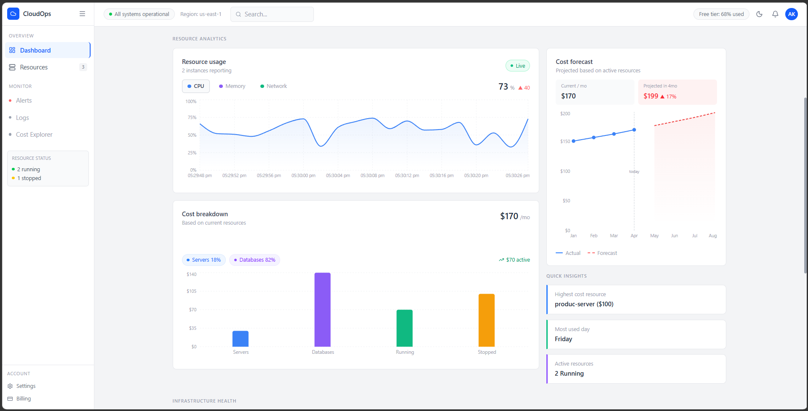
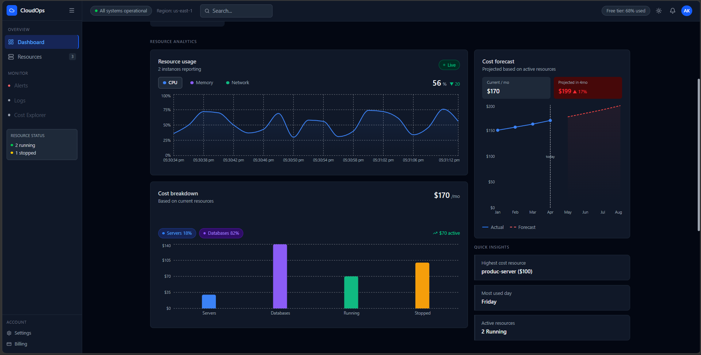
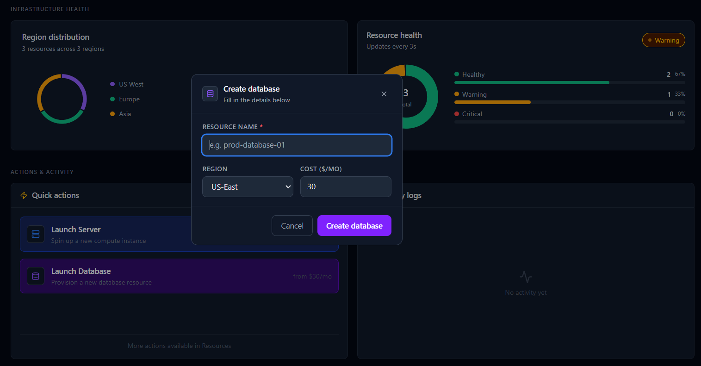
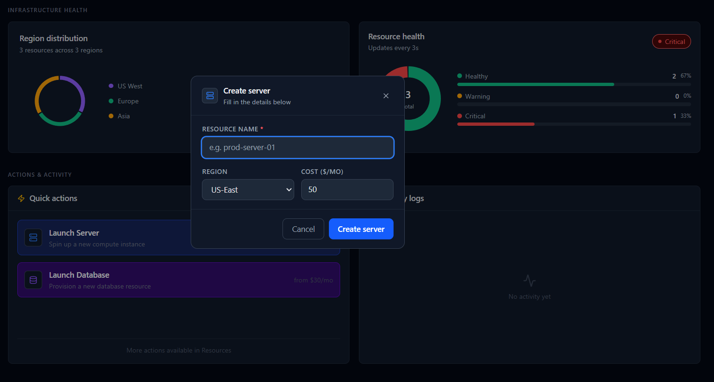
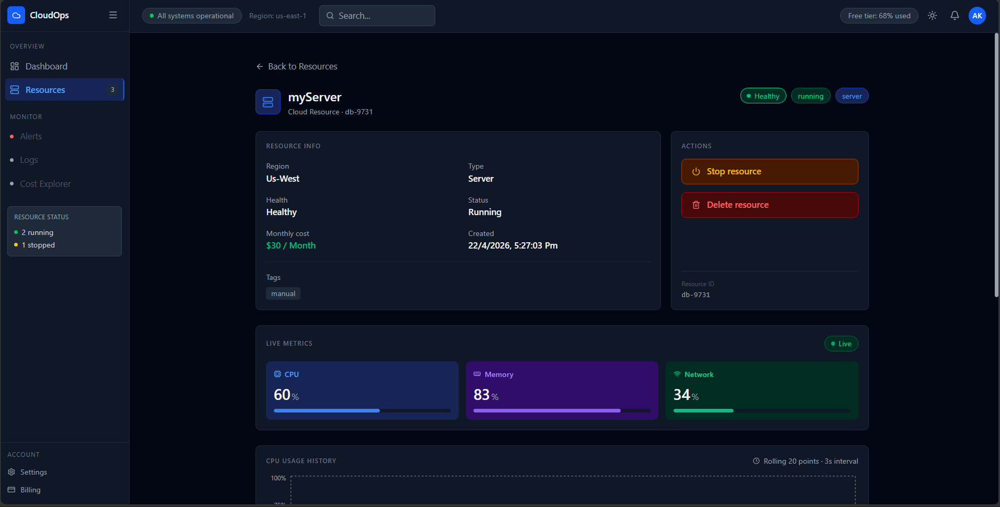

# ☁️ CloudOps Dashboard

A modern cloud infrastructure management dashboard built using **React.js**, designed to simulate real-time cloud resource monitoring, management, and cost tracking.

This project allows users to create, manage, monitor, and analyze cloud resources such as servers and databases through an interactive dashboard interface.

---

## 🚀 Features

### Dashboard Analytics
- Real-time resource usage monitoring
- CPU usage tracking
- Cost forecasting chart
- Cost breakdown analytics
- Quick insights section
- Infrastructure health monitoring
- Region distribution tracking
- Activity logs

---

### Resource Management
- Add new cloud resources
- Create server instances
- Create database resources
- Edit existing resources
- Delete resources
- Start/Stop resources
- Search resources
- Filter by resource type
- Filter by status

---

### Resource Details
- View detailed information of each resource
- Live CPU metrics
- Memory metrics
- Network metrics
- Resource health tracking
- Monthly cost information
- Resource status details

---

## 🛠️ Tech Stack

### Frontend
- React.js
- Vite
- JavaScript
- Tailwind CSS / Custom CSS

### Libraries Used
- Recharts → Data visualization
- Lucide React → Icons
- React Router DOM → Routing


## 📸 Project Screenshots

### 1. Dashboard Overview
Shows resource analytics, live monitoring, and system overview.



---

### 2. Cost Analytics Dashboard
Displays cost forecasting and resource cost breakdown.



---

### 3. Infrastructure Health
Shows region distribution, health monitoring, and activity logs.


---

### 4. Create Database
Create new database resources.



---

### 5. Create Server
Launch new server resources.



---

### 6. Resource List
Displays all available resources.


---

### 7. Edit Resource
Update resource details.


---

### 8. Resource Details
Detailed monitoring page for each resource.



## 📂 Project Structure

```cloudops/
│
├── public/
│
├── src/
│
│   ├── components/
│   │
│   │   ├── dashboard/
│   │   │
│   │   │   ├── StatsCards.jsx
│   │   │   ├── UsageChart.jsx
│   │   │   ├── CostChart.jsx
│   │   │   ├── RegionChart.jsx
│   │   │   ├── CostForecastChart.jsx
│   │   │   ├── HealthChart.jsx
│   │   │   ├── QuickActions.jsx
│   │   │   └── ActivityLogs.jsx
│   │
│   │   ├── layout/
│   │   │
│   │   │   ├── Sidebar.jsx
│   │   │   └── Header.jsx
│   │
│   │   └── resources/
│   │
│   │       ├── ResourceCard.jsx
│   │       ├── ResourceList.jsx
│   │       ├── ResourceForm.jsx
│   │       └── ResourceActivity.jsx
│
│
│   ├── pages/
│   │
│   │   ├── Dashboard.jsx
│   │   ├── Resources.jsx
│   │   └── ResourceDetails.jsx
│
│
│   ├── context/
│   │
│   │   ├── ResourceContext.jsx
│   │   ├── ThemeContext.jsx
│   │   └── LogContext.jsx
│
│
│   ├── services/
│   │
│   │   └── api.js
│
│
│   ├── data/
│   │
│   │   └── resourceMetrics.js
│
│
│   ├── utils/
│   │
│   │   └── generateMetrics.js
│
│
│   ├── App.jsx
│   ├── main.jsx
│   └── index.css
│
│
├── package.json
├── vite.config.js
└── README.md
```
